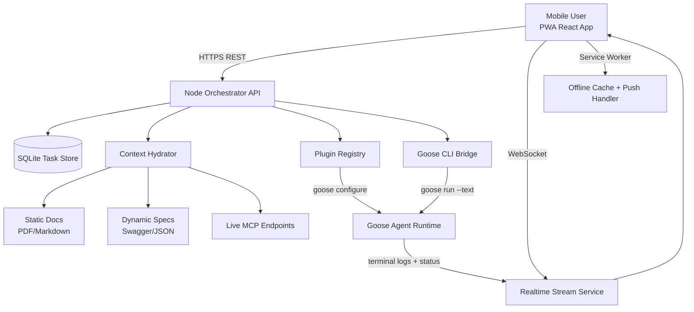

# System Architecture (MVP)

## Runtime Flow

1. User drags task to `In Progress`.
2. Frontend calls `PATCH /tasks/:id/status`.
3. Backend hydrates prompt from attached context.
4. Goose bridge starts execution (mocked now), emits logs/status via WebSocket.
5. Frontend task card updates in real-time; mini-terminal shows stream.
6. On completion, browser push notification is shown (local notification fallback).
